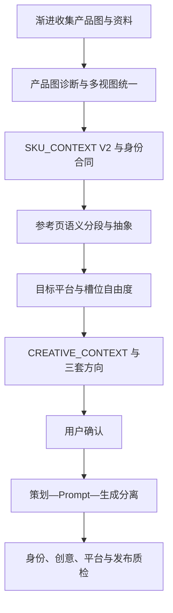

<h1 align="center">KeRo SKU Director Agent</h1>

<p align="center">锁定真实 SKU 身份、释放视觉表达的 Codex 电商总导演：诊断产品图、拆解参考页、提出三套创意方向，并按平台槽位完成策划、Prompt、生产与质检。</p>

<p align="center">
  <strong>作者：秋水 Kero</strong><br>
  <a href="https://x.com/Isonlyonenice" aria-label="作者的 X 主页">
    <picture>
      <source media="(prefers-color-scheme: dark)" srcset="./assets/x-logo-dark.svg">
      
    </picture>
  </a>&nbsp;&nbsp;&nbsp;
  <a href="https://github.com/Youks7/KeRo-SKU-skill">原始 Skill 仓库</a>&nbsp;&nbsp;&nbsp;
  <a href="./">当前 Agent 仓库</a>
</p>

> **安装一次，调用多次。** 安装时使用这个仓库；处理商品时只需要启动 `kero-sku-director`。

| 我现在要做什么 | 直接前往 |
| --- | --- |
| 在 Windows 新电脑安装 | [Windows 快速安装](#windows-快速安装) |
| 在 Mac 新电脑安装 | [macOS 快速安装](#macos-快速安装) |
| 安装后第一次使用 | [启动 Agent](#启动-agent) |
| 继续以前的 SKU 项目 | [恢复项目](#恢复项目) |
| 查看完整说明 | [文档入口](#文档入口) |

## 三分钟开始

### Windows 快速安装

Windows 已提供并验证 PowerShell 安装器：

```powershell
git clone https://github.com/Youks7/KeRo-SKU-Agent.git
Set-Location .\KeRo-SKU-Agent
.\scripts\install_kero_sku.ps1
```

默认安装到：

```text
C:\Users\<用户名>\.codex\agents\kero-sku-director.toml
C:\Users\<用户名>\.codex\skills\<skill-name>\
```

#### 让 Codex 代为完成 Windows 安装

```text
我的电脑是 Windows。请安装公开仓库：
https://github.com/Youks7/KeRo-SKU-Agent

请克隆 main 分支并运行 .\scripts\install_kero_sku.ps1。
CODEX_HOME 未设置时使用 %USERPROFILE%\.codex。
需要联网或写入用户 .codex 目录时向我申请权限。
同名内容相同时跳过；内容不同时停止并报告，不要直接覆盖。
安装后验证 kero-sku-director 和十个 sku-* Skills，并检查每个 Skill 都有 SKILL.md。
最后报告实际安装路径、验证结果和是否需要重启 Codex；失败时返回真实错误。
```

### macOS 快速安装

macOS 当前支持安全手动安装，尚未提供自动安装脚本。不要在 Mac 上运行 Windows 的 `.ps1` 文件。

在 Codex 新任务中复制并发送下面的安装指令：

#### 让 Codex 代为完成 macOS 安全手动安装

```text
我的电脑是 macOS。请安装公开仓库：
https://github.com/Youks7/KeRo-SKU-Agent

不要运行 scripts/install_kero_sku.ps1。
先解析 TARGET_CODEX_HOME：CODEX_HOME 已设置时使用其值，否则使用 $HOME/.codex。
如有需要，先创建 $TARGET_CODEX_HOME/agents 和 $TARGET_CODEX_HOME/skills。
把 .codex/agents/kero-sku-director.toml 复制到 $TARGET_CODEX_HOME/agents/。
查找并完整复制十个包含 SKILL.md 的 sku-* Skill 目录到 $TARGET_CODEX_HOME/skills/。
sku-detail-page-director 的上级目录可能包含中文，请通过 sku-detail-page-director/SKILL.md 定位。
需要联网或写入 TARGET_CODEX_HOME 时向我申请权限。
同名内容相同时跳过；内容不同时停止并报告，不要覆盖或删除。
最后验证一个 Agent 和十个 Skills，报告安装路径、验证结果和是否需要重启 Codex。
如果当前环境不支持个人自定义 Agent，请明确报告，不要假装安装成功。
```

默认安装到：

```text
/Users/<用户名>/.codex/agents/kero-sku-director.toml
/Users/<用户名>/.codex/skills/<skill-name>/
```

安装完成后新建 Codex 任务；新任务仍找不到 Agent 时，再完全退出并重新启动 Codex。

## 启动 Agent

打开 SKU 项目文件夹作为 Codex 工作区，然后发送：

```text
请启动并把任务委派给 kero-sku-director 自定义 Agent。

如果找不到这个 Agent，请停止并明确报告，不要在主 Agent 中模拟它已经运行。

项目目录：[填写目录]
目标平台：[填写平台和站点]
原始产品资料：[填写资料目录]

请渐进式完成产品图诊断、多视图统一、事实分析、SKU_CONTEXT V2、
IDENTITY_CONTRACT、参考详情页语义分段、平台路由和 CREATIVE_CONTEXT，
并提供三个在创意命题、场景、商品角色、镜头光线和叙事上真正不同的方向。

不得编造品牌、规格、尺寸、材质、认证、功效、评价、销量、价格或售后承诺。
锁定商品身份但不要把所有详情素材强制做成同一张原图抠图换背景；按槽位选择 F0–F3。
方向确认前不要生成正式生产 Prompt，也不要写入最终交付目录。
```

## 工作流程



Agent 不会取代 Skills。它负责状态、路由、确认门和文件边界；十个 Skills 继续提供产品事实与平台专业规则。

## 常用指令

### 确认方向

```text
确认方向 [填写编号]。

请继续使用 kero-sku-director，生成平台素材槽位规划、逐素材 Prompt、
Negative Prompt、F0–F3 产品处理模式、身份锚点、文案位置、排版要求和发布质检清单。
结果保存到当前 SKU 项目目录，不要覆盖原始素材。
```

### 恢复项目

```text
请启动并把任务委派给 kero-sku-director 自定义 Agent。
继续项目：[填写项目目录]

先读取并验证唯一权威状态 01-context/SKU_CONTEXT.json；它已经包含身份合同、
创意上下文、方向和生产进度。可选 project-state.json 只能在 state_revision 一致时作索引。
复用已确认内容，先恢复第一个未完成阶段；方向批准后才使用 resume_from 或未完成生产单元。
找不到 Agent 或权威状态时明确报告。
```

## 文件保存在哪里

| 位置 | 保存内容 |
| --- | --- |
| GitHub 仓库 | Agent、Skills、安装器和文档源码 |
| 用户 `.codex` 目录 | 安装后的 Agent 与十个 Skills |
| 独立 SKU 项目目录 | 产品图片、事实档案、方向、Prompt、生成结果和质检报告 |

<details>
<summary>推荐的 SKU 项目目录</summary>

```text
KE-2026-001/
├── 00-inputs/
│   ├── originals/
│   ├── packaging/
│   ├── documents/
│   └── brand-assets/
├── 01-context/
│   ├── SKU_CONTEXT.json
│   ├── IDENTITY_CONTRACT.json        # 可选导出视图
│   ├── CREATIVE_CONTEXT.json         # 可选导出视图
│   ├── reference-abstraction.json    # 可选导出视图
│   └── project-state.json            # 可选索引，不覆盖权威状态
├── 02-directions/
├── 03-prompts/
├── 04-generated/
├── 05-layout/
├── 06-final/
└── 07-qa/
```

</details>

`00-inputs/originals` 默认只读。不得把商品资料或项目结果写进 Agent、Skill 或插件安装目录。

`01-context/SKU_CONTEXT.json` 是唯一权威状态文件。其他 context JSON 只为阅读和交接服务；发生冲突时不得拼接猜测，按 `state_revision` 规则恢复或进入人工审核。

同一 SKU 做多个平台时，Agent 会在这个权威文件的 `platform_contexts` 中分别保存各平台的方向、生产进度和 QA，并用 `active_platform_context_id` 标记当前平台；切换平台不会覆盖其他平台进度。

## 能做什么，不能保证什么

| Agent 能做 | Agent 不能保证 |
| --- | --- |
| 分析产品事实和证据缺口 | 自动知道用户没有提供的规格 |
| 建立并复用 `SKU_CONTEXT V2`、身份合同和创意上下文 | 不保存项目文件却永久记住所有项目 |
| 路由八个平台的专业 Skill | 缺少平台 Skill 时模拟完整规则 |
| 拆解参考页并生成三个差异化方向 | 照抄竞品商品、Logo、文案或独特视觉 |
| 按槽位选择 F0–F3，生成 Prompt、排版和质检方案 | 没有图像工具时直接完成生图 |
| 检查产品和主张是否失真 | 未授权时操作电商平台后台 |

竞品只能用于分析构图、节奏和信息结构，不能复制竞品产品、Logo、文案或品牌资产。

<details>
<summary>安装内容：一个 Agent 和十个 Skills</summary>

```text
kero-sku-director
sku-detail-page-director
sku-product-core
sku-taobao
sku-tmall
sku-pinduoduo
sku-jd
sku-1688
sku-amazon
sku-shopify
sku-tiktok-shop
```

</details>

## 更新与验证

Windows 更新：

```powershell
Set-Location .\KeRo-SKU-Agent
git pull origin main
.\scripts\install_kero_sku.ps1 -Force
```

`-Force` 会先把不同版本备份到 `%CODEX_HOME%\backups\kero-sku\<时间戳>\`。macOS 更新时先比较并备份现有目录，再复制新版本。

<details>
<summary>仓库维护者验证命令</summary>

```powershell
python scripts/validate_agent.py
python scripts/validate_all_skills.py
python scripts/validate_trigger_cases.py
python scripts/validate_orchestration.py
python scripts/validate_creative_system.py
python scripts/validate_resume_state.py
python scripts/validate_production_protocol.py
```

真实墨镜外部夹具的执行方法、检查结果和诚实边界见 [`tests/real-sku/REAL_SUNGLASSES_REGRESSION.md`](./tests/real-sku/REAL_SUNGLASSES_REGRESSION.md)。私有商品图不会提交到公开仓库。静态验证和输入完整性验证都不能替代对实际 F2 成图的人工身份审核。

</details>

## 文档入口

- [Agent 完整指南](./docs/AGENT.md)
- [安装与更新](./docs/INSTALL.md)
- [常见问题](./docs/TROUBLESHOOTING.md)
- [安全与使用边界](./docs/SAFETY_AND_USAGE.md)
- [Agent 行为场景](./tests/agent_cases.yaml)
- [真实墨镜外部夹具回归](./tests/real-sku/REAL_SUNGLASSES_REGRESSION.md)
- [版本记录](./CHANGELOG.md)

## 许可

使用和再发布前请阅读 [LICENSE](./LICENSE) 与 [NOTICE.md](./NOTICE.md)。第三方平台名称、商标、产品和工具名称归各自权利人所有。
